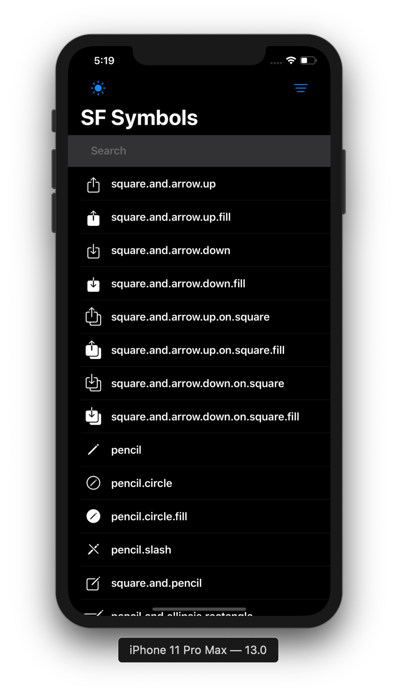
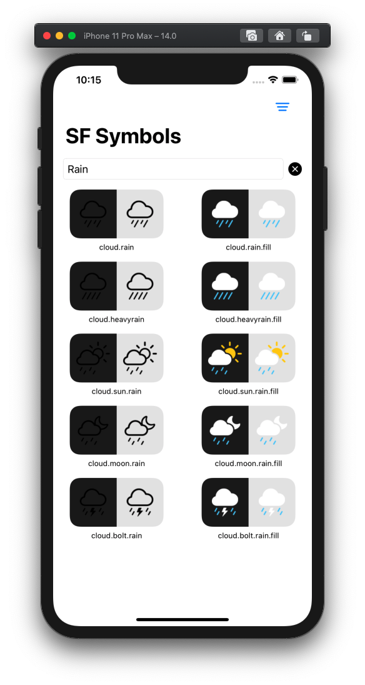
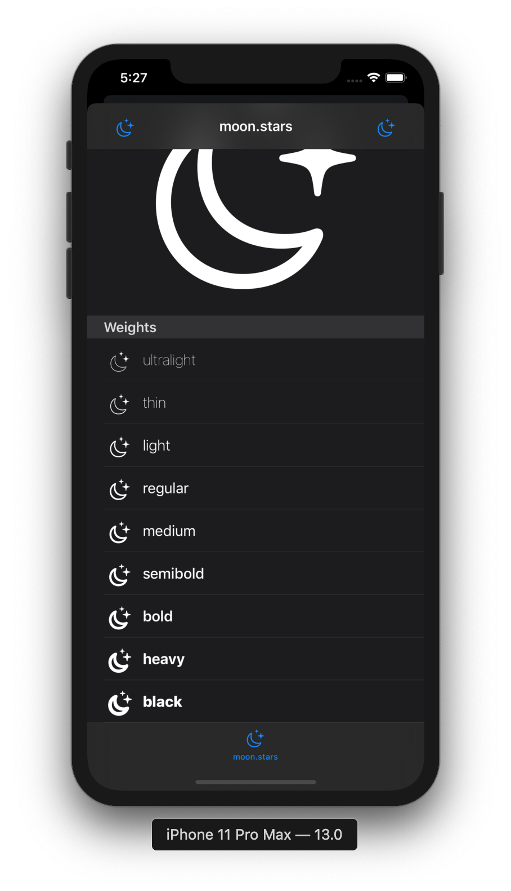

# SF Symbols - SwiftUI App

> Experimenting with SwiftUI whilst creating a practical app to browse the SF Symbols via an iOS app.

### List all SF Symbols

### Dark/Light toggle

### Sort

### Filter

### Symbol details
Showcase the symbol in the navigation bar, tab bar, etc

### Show symbol weights

### Known issues

- SwiftUI does not handle dynamically filtering a list of 1600+ items, 100% CPU for 8 seconds (I capped the results to filter the first 50 symbols and exposed a `See all` option as a workaround)
- iPad master/detail view
- The symbols are copied from the SF Symbols beta mac app (this is a manual process)
- There are a handful of icons that no longer exist in Xcode 11 GM Seed (but still exist on the SF Symbols mac app)

### Disclaimer

> This is posted as a way to share SwiftUI learnings. Use it at your own risk.

> It is your responsibility to make sure you are following the terms and conditions of using Apple's symbols. For more information, see [https://developer.apple.com/design/human-interface-guidelines/sf-symbols/overview/](https://developer.apple.com/design/human-interface-guidelines/sf-symbols/overview/).