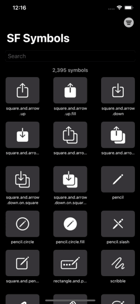
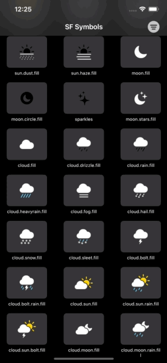

    
    
    
    

 
# SF Symbols (SwiftUI App)
> Experimenting with SwiftUI whilst creating a practical app to browse the SF Symbols via an iOS/iPadOS app.

### Known issues

**Limited support**

According to an Apple Frameworks Engineer, multicolor symbols are not supported on iOS yet.
[https://developer.apple.com/forums/thread/651671?answerId=616617022#616617022](https://developer.apple.com/forums/thread/651671?answerId=616617022#616617022)

**Dynamic text sizing affects colors**

**Multicolor symbols appear fuzzy**

Altering the symbols via `font` or `resizable` loses the colors, `scaleEffect` is used for now until there is official support for iOS.

### Disclaimer

> This is posted as a way to share SwiftUI learnings (and is not production level code). Use it at your own risk.

> It is your responsibility to make sure you are following the terms and conditions of using Apple's symbols. For more information, see [https://developer.apple.com/sf-symbols/](https://developer.apple.com/sf-symbols/). Read the Human Interface Guidelines to learn how to make the most of SF Symbols, [Human Interface Guidelines](https://developer.apple.com/design/human-interface-guidelines/sf-symbols/overview/).
