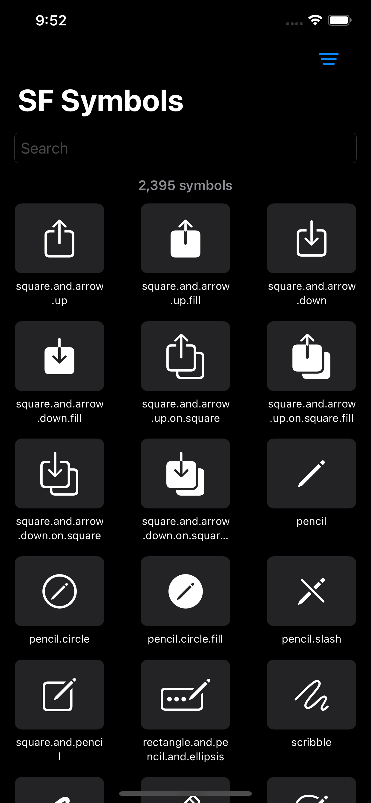
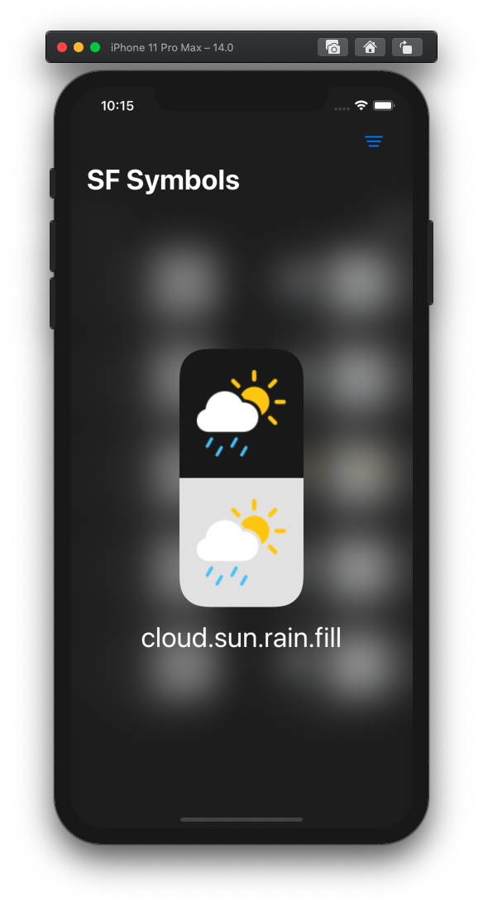

<p align="center"></p>

# SF Symbols - SwiftUI App

> Experimenting with SwiftUI whilst creating a practical app to browse the SF Symbols via an iOS app.

### List all SF Symbols
Now showing in a grid 🆕

Also SF Symbol icons rendered as original have their own colors 😍

```
Image(systemName: "cloud.sun.rain.fill")
	.renderingMode(.original)
```



### Sort


### Enlarge


### Filter


### Known issues

- iPad layout is broken
- The symbols names are manually copied from the SF Symbols mac app (no known API to get icons.. yet? 🤔)
- Dynamic text sizing, setting icon size via text, or resizing icons via `resizable` seems to remove the original colors (work around was to use `scaleEffect`)

### Disclaimer

> This is posted as a way to share SwiftUI learnings (and is not production level code). Use it at your own risk.

> It is your responsibility to make sure you are following the terms and conditions of using Apple's symbols. For more information, see [https://developer.apple.com/design/human-interface-guidelines/sf-symbols/overview/](https://developer.apple.com/design/human-interface-guidelines/sf-symbols/overview/).
