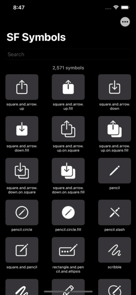
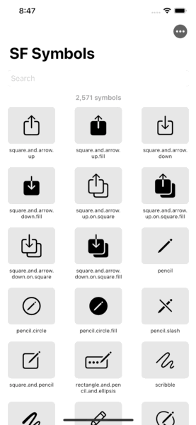

    
    
    
    
    

# SF Symbols (SwiftUI 2.0 App)
> Experimenting with `SwiftUI 2.0` whilst creating a practical app to browse the SF Symbols via an iOS/iPadOS app.

 

### 👨🏻‍⚖️ Disclaimer

> This is posted as a way to share SwiftUI learnings (and is not production level code). Use it at your own risk.

> It is your responsibility to make sure you are following the terms and conditions of using Apple's symbols. For more information, see [https://developer.apple.com/sf-symbols/](https://developer.apple.com/sf-symbols/). Read the Human Interface Guidelines to learn how to make the most of SF Symbols, [Human Interface Guidelines](https://developer.apple.com/design/human-interface-guidelines/sf-symbols/overview/).
